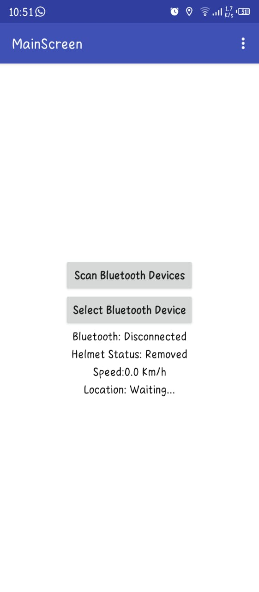
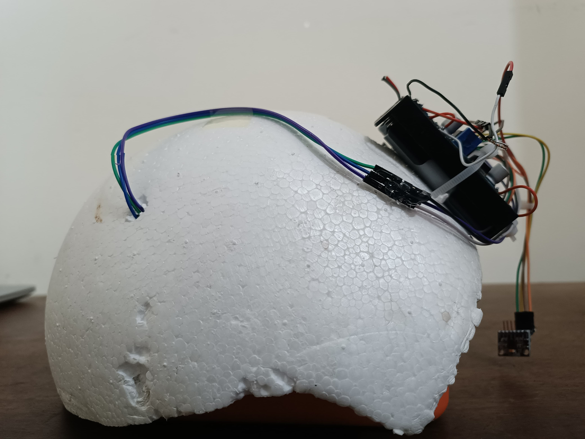
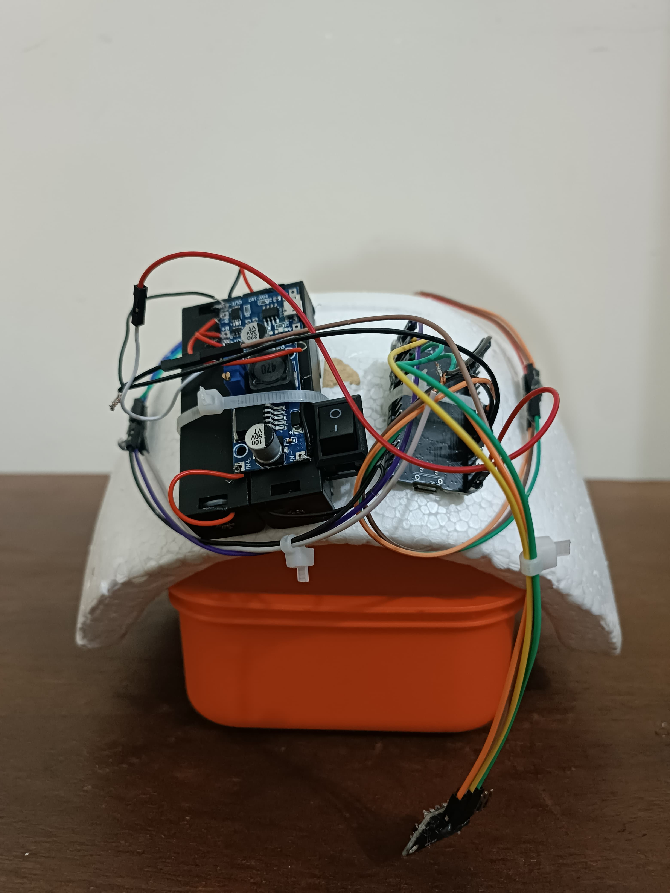

# IMU-Based Smart Bike Crash Detection and Response System

This project demonstrates a smart crash detection system for bikers using two ESP32 modules, an MPU6050 sensor, and capacitive touch input. The modules communicate wirelessly via Bluetooth to detect sudden changes in motion and respond by triggering safety mechanisms or alerts.

## 📽️ Project Demo

[Watch the Full Video Demonstration](https://your-demo-video-link.com)

---

## Project Overview

This system is divided into two main ESP32-based modules:

### 1. **Sensor & Detection Module**
- **MPU6050**: Reads acceleration and angular velocity values to detect sudden impacts.
- **Capacitive Touch Sensor**: Used for manual input or override.
- **Bluetooth**: Sends data wirelessly to the response module.
- **Power**: Dual 3.7V LiPo batteries (combined ~7.15V) regulated by a **Buck Converter** to maintain a steady 4.5V.
- **Charging Module**: The **TP4056** is used to safely recharge LiPo batteries.

### 2. **Relay & Response Module**
- **Relay Module**: Can control external hardware (e.g., emergency alert systems, vehicle shutdown).
- **ESP32**: Receives Bluetooth data and triggers actions based on detected crash events.
- **Power**: Similar LiPo + Buck + TP4056 setup as the detection module.

---

## Features

- **Real-time Crash Detection:**  
  Detects crashes using thresholds on resultant acceleration, angular velocity, and calculated jerk for accurate impact assessment.

- **Wireless Bluetooth Communication:**  
  Two ESP32 modules communicate wirelessly—one for helmet sensing (MPU6050 + capacitive touch), the other for bike relay control.

- **Mobile App Integration:**  
  A custom smartphone app connects via Bluetooth to receive speed, longitude, latitude, and crash status in real-time.

- **Crash Notification System via GSM:**  
  Upon crash detection, the app uses the mobile phone’s GSM and GPS modules to send an SMS to a pre-saved emergency contact with the location details.

- **Helmet Fit Verification:**  
  A capacitive touch sensor ensures the helmet is worn before allowing engine ignition, enforcing safe riding practices.

- **Safe and Rechargeable Power Supply:**  
  Each ESP32 is powered by dual 3.7v LiPo batteries, regulated to ~4.5v via a buck converter and TP4056 charging module, ensuring stability and rechargeability.

- **Compact and Portable Design:**  
  Lightweight, LiPo-powered modules suitable for integration directly into helmets or mounted on bike frames.

---

## Project Images

### Software Screenshots

--  Main Screen --

--  Home Screen  --

--  Setup Screen  --

### Hardware Pictures

--  Helmet's Side View  --

--  Helmet's Front View  --
